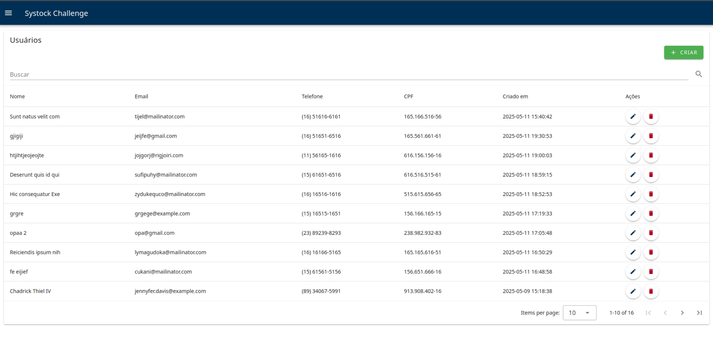

# Javascript Challenge

Projeto desenvolvido para o desafio da Systock.

## 🚀 Começando

Consulte **Instalação** para saber como instalar o projeto.

### 📋 Pré-requisitos

- Vue ^3.5.13;
- NodeJs ^22.14;
- Npm ^10.9;
- Vuetify ^3.8;
- TypeScript ^5.8;
- Pinia ^3.0;
- Docker ^27.1;
- Docker Compose ^2.29;
- Vite ^4.4;

### 🔧 Instalação

Dentro da pasta do projeto, rode os comandos na ordem abaixo.

```
docker compose up -d

```

Aguarde o projeto iniciar e acesse a url **http://localhost:3000** para ver o projeto em execução.

## 🎨 Visual

Link: [http://localhost:3000](http://localhost:3000)



## 🛠️ Construído com

- [Vue](https://vuejs.org/) - Frontend
- [Vuetify](https://vuetifyjs.com/en/) - Estilos
- [NodeJs](https://nodejs.org/) - Backend
- [Npm](https://www.npmjs.com/) - Gerenciador de pacotes
- [Vite](https://vitejs.dev/) - Ambiente de desenvolvimento
- [Pinia](https://pinia.vuejs.org/)
- [TypeScript](https://www.typescriptlang.org/) - Linguagem de programação
- [Docker](https://www.docker.com/) - Ambiente
- [Docker Compose](https://docs.docker.com/compose/) - Gerenciador de containers

## ✒️ Autores

- **Kevin Smith** - _Desenvolvimento_ - [Kevin Smith](https://github.com/kevinsmitth)
